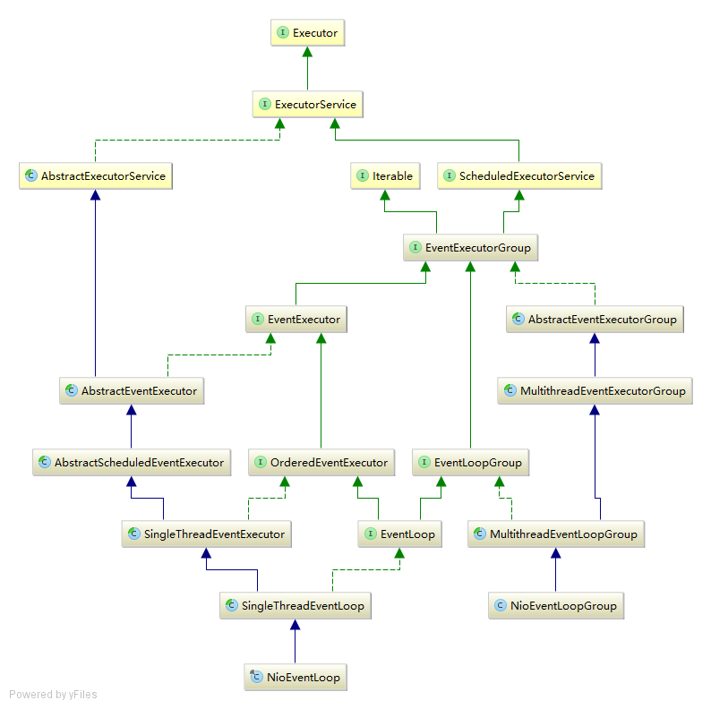

Netty线程调度相关的程序和类继承体系如下：

总的来说，这些类都负责线程的调度执行，具备线程池的功能。按照处理的维度不同可以划分为以下两类：
+ __面向事件执行__，即链接上的事件具体如何被执行，在类的命名中包含Executor关键字
+ __面向事件循环__，即链接上的事件如何被发现(也就是Selector对链接的管理), 在类的命名中包含Loop关键字

这些类的命名还有一个特征：单一执行单元或者调度单元均不包含Group，且继承自执行单元组和调度单元组，通过每次都选中自己来保持继承关系在语义上的正确性。
